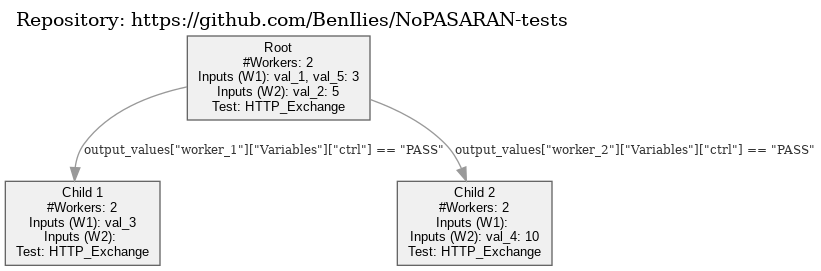

# Tests-Trees

This repository contains a Python framework for creating, saving, loading, and evaluating decision trees used within the nopasaran framework. The decision trees allow for complex testing scenarios where the outcome of one test can determine the next steps based on predefined conditions.

## Features

- **Create**: Build decision trees that represent test sequences.
- **Save**: Export the decision tree to a PNG file with embedded metadata for easy storage.
- **Load**: Load a decision tree from a PNG file, preserving the structure and data.
- **Evaluate**: Execute the decision tree, evaluating conditions and navigating through the tree based on test results.

## Prerequisites

Before using the framework, make sure you have Python installed. You can then install the required packages by running:

\```bash
pip install -r requirements.txt
\```

## How to Create and Evaluate a Test Tree

The following steps show how to create a decision tree, save it as a PNG file, load it back, and evaluate it using predefined inputs.

### 1. Create and Save a Test Tree

The first step is to create the structure of the decision tree. Below is an example of how to create a simple tree with a root node and two child nodes. Each node can have multiple workers, and the inputs required by each worker can be specified.

\```python
from tests_tree import TestsTreeNode, TestsTree

class TestsTreeTest:
@staticmethod
def save_tree(): # Define the root node
root = TestsTreeNode(
'Root',
num_workers=2,
inputs=[{'role': (None, False)}, {'role': (None, False)}],
test='HTTP_Exchange'
)

        # Define child nodes
        child1 = TestsTreeNode(
            'Child 1',
            num_workers=2,
            inputs=[{'role': (None, False)}, {'role': (None, False)}],
            test='HTTP_Exchange'
        )

        child2 = TestsTreeNode(
            'Child 2',
            num_workers=2,
            inputs=[{'role': (None, False)}, {'role': (None, False)}],
            test='HTTP_Exchange'
        )

        # Initialize the tree with a repository link
        repository = "https://github.com/nopasaran-org/nopasaran-tests"
        tree = TestsTree(repository=repository)

        # Add the root node and connect the child nodes with conditions
        tree.add_root(root)
        tree.add_edge(root, child1, ['output_values["worker_1"]["Variables"]["ctrl"] == "PASS"'])
        tree.add_edge(root, child2, ['output_values["worker_2"]["Variables"]["ctrl"] == "PASS"'])

        # Save the tree as a PNG file with metadata
        png_filename = 'tests_tree.png'
        tree.save_png_with_metadata(png_filename)
        print(f"Tests tree image saved as '{png_filename}'.")

TestsTreeTest.save_tree()
\```

### 2. Load and Evaluate the Test Tree

Once the decision tree is saved, you can load it from the PNG file and evaluate it by providing inputs for each node. The evaluation process will navigate through the tree based on the conditions and produce a final output.

\```python
class TestsTreeTest:
@staticmethod
def load_and_evaluate_tree():
tree = TestsTree()
png_filename = 'tests_tree.png'
tree.load_from_png(png_filename)

        # Define the inputs for each node
        node_inputs = {
            'Root': {'Worker_1': {'role': "client"}},
            'Child 1': {'Worker_1': {'role': "client"}},
            'Child 2': {'Worker_2': {'role': "client"}}
        }

        # Evaluate the tree and print the final output
        try:
            final_output = tree.evaluate_tree(node_inputs)
            print(f"Final output value: {final_output}")
        except ValueError as e:
            print(f"Error during evaluation: {e}")

TestsTreeTest.load_and_evaluate_tree()
\```

### Explanation of Variables

- **`root` and `child1`, `child2`**: These are instances of `TestsTreeNode`, representing nodes in the decision tree.
- **`num_workers`**: The number of workers or parallel processes that will be running in each node. In the example, both the root and child nodes have two workers.
- **`inputs`**: A list of dictionaries representing the input parameters for each worker. Each key in the dictionary is an input parameter, and the value is a tuple where the first element is the default value, and the second element is a boolean indicating whether the input is mandatory (`False` if mandatory, `True` if it has a default value).
- **`test`**: A string representing the test to be executed at this node.
- **`conditions`**: Conditions under which a particular child node should be evaluated. These conditions are based on the output of the previous node's test.

### Example Output

After running the above code, the decision tree structure will be saved as a PNG file (`tests_tree.png`). The image includes the tree structure and metadata. The following example tree is generated:



The tree is then loaded, and based on the input provided, the conditions are evaluated to determine which path the tree should follow. The final output is displayed in the console.
